# HPE Opportunity Intelligence Platform - Database Documentation

## 📊 Database Overview

### Quick Stats
| Metric | Value |
|--------|--------|
| **Database Type** | SQLite |
| **Total Tables** | 4 |
| **Total Records** | 32,133 |
| **Database Size** | 17.06 MB |
| **Query Performance** | <10ms average (34.6x faster than Excel) |
| **Total Opportunities** | 22,002 |

---

## 🗂️ Entity Relationship Diagram

```mermaid
graph TB
    subgraph "Core Data Tables"
        OPPORTUNITIES["📊 OPPORTUNITIES<br/>22,002 records<br/>PL assignments"]
        SERVICES_SKILLSETS["⚙️ SERVICES_SKILLSETS<br/>226 mappings<br/>Services to Skillsets"]
        SKILLSETS_SKILLS["📚 SKILLSETS_SKILLS<br/>3,451 mappings<br/>Skillsets to Skills"]
        EMPLOYEE_SKILLS["👥 EMPLOYEE_SKILLS<br/>6,654 records<br/>Employee proficiencies"]
    end

    subgraph "Data Flow"
        OPPORTUNITIES -->|Product Line| SERVICES_SKILLSETS
        SERVICES_SKILLSETS -->|Skill Set| SKILLSETS_SKILLS
        SKILLSETS_SKILLS -->|Skills Name| EMPLOYEE_SKILLS
        EMPLOYEE_SKILLS -->|Resource Matching| OPPORTUNITIES
    end

    classDef entity fill:#e1f5fe,stroke:#01579b,stroke-width:2px,color:#000
    class OPPORTUNITIES,SERVICES_SKILLSETS,SKILLSETS_SKILLS,EMPLOYEE_SKILLS entity
```



---

## 📁 Database Tables with Structure

### 1️⃣ **opportunities** Table
*Stores all HPE opportunities with Product Line assignments*

| Column | Type | Description | Example |
|--------|------|-------------|---------|
| HPE Opportunity Id | TEXT | Unique opportunity identifier | "OPP001234" |
| Opportunity Name | TEXT | Description of opportunity | "Cloud Migration Project" |
| Product Line | TEXT | PL code (direct mapping) | "60", "1Z", "5V", etc. |
| Product Line Description | TEXT | PL name | "Cloud-Native Pltfms" |
| Stage | TEXT | Sales stage | "Qualified", "Propose", etc. |
| Close Date | TEXT | Expected close date | "2025-03-31" |
| Schedule Amount (converted) | REAL | Opportunity value | 1250000.00 |
| Additional columns... | | Account, region, etc. | |

#### Key Statistics:
- **Total Records**: 22,002
- **PLs with Mappings**: 6 (60, 1Z, 5V, 4J, G4, PD)
- **Indexed Column**: Product Line

---

### 2️⃣ **services_skillsets** Table
*Maps services to required skillsets by Product Line*

| Column | Type | Description | Example |
|--------|------|-------------|---------|
| FY25 PL | TEXT | Product Line with suffix | "60 (IJ)", "1Z (PN)" |
| New Service Name | TEXT | Service description | "AI Model Development" |
| Skill Set | TEXT | Required skillset | "Machine Learning" |
| Services Description | TEXT | Detailed service info | "Develop and train ML models" |
| Additional columns... | | Technical domain, etc. | |

#### Key Statistics:
- **Total Records**: 226
- **Unique Services**: ~50
- **Unique Skillsets**: 179 (mapped)
- **Indexed Columns**: FY25 PL, Skill Set

---

### 3️⃣ **skillsets_skills** Table
*Maps skillsets to individual skills*

| Column | Type | Description | Example |
|--------|------|-------------|---------|
| FY'24 Skillset Name | TEXT | Previous year skillset | "AI/ML Development" |
| FY'25 Skillset Name | TEXT | Current year skillset | "Machine Learning" or "No change" |
| Skills Name | TEXT | Individual skill | "Python", "TensorFlow" |
| sheet_name | TEXT | Source sheet identifier | "Converged_Edge", "Data & AI" |
| Additional columns... | | Skill details | |

#### Key Statistics:
- **Total Records**: 3,451
- **Source Sheets**: Multiple categories
- **"No change" Handling**: Uses FY'24 name when FY'25 is "No change"
- **Indexed Columns**: FY'25 Skillset Name, FY'24 Skillset Name

---

### 4️⃣ **employee_skills** Table
*Employee skills with proficiency ratings*

| Column | Type | Description | Example |
|--------|------|-------------|---------|
| Resource_Name | TEXT | Employee name | "John Smith" |
| Skill_Certification_Name | TEXT | Skill name | "Python Programming" |
| Skill_Set_Name | TEXT | Associated skillset | "Machine Learning" |
| Proficieny_Rating | REAL | Numeric rating (2-5) | 4.0 |
| Rating | TEXT | Text description | "4 - Advanced" |
| Additional columns... | | Location, certification date | |

#### Key Statistics:
- **Total Records**: 6,654
- **Unique Resources**: 505
- **Proficiency Scale**: 2 (Basic) to 5 (Expert)
- **Indexed Columns**: Resource_Name, Skill_Set_Name

---

## 🔄 Data Flow and Chain Analysis

### Complete Opportunity-to-Resources Chain

```
1. OPPORTUNITY Selection
   └─> Product Line (e.g., "60")

2. PRODUCT LINE Mapping
   └─> Services (via FY25 PL = "60 (IJ)")

3. SERVICES Requirements
   └─> Skillsets (via Skill Set field)

4. SKILLSETS Breakdown
   └─> Individual Skills (via FY'25 or FY'24 names)

5. SKILLS Matching
   └─> Resources with Proficiency Ratings
```

### Example Chain: Cloud-Native Platform Opportunity

```sql
-- Step 1: Select opportunity
SELECT * FROM opportunities
WHERE [Product Line] = '60';

-- Step 2: Find services
SELECT DISTINCT [New Service Name], [Skill Set]
FROM services_skillsets
WHERE [FY25 PL] = '60 (IJ)';

-- Step 3: Find skills
SELECT DISTINCT [Skills Name]
FROM skillsets_skills
WHERE [FY'25 Skillset Name] IN (
    SELECT DISTINCT [Skill Set]
    FROM services_skillsets
    WHERE [FY25 PL] = '60 (IJ)'
);

-- Step 4: Find resources
SELECT DISTINCT Resource_Name, Proficieny_Rating
FROM employee_skills
WHERE Skill_Set_Name IN (
    SELECT DISTINCT [Skill Set]
    FROM services_skillsets
    WHERE [FY25 PL] = '60 (IJ)'
)
AND Proficieny_Rating >= 3;
```

---

## 📈 Product Line Mapping

### Direct PL Code Mappings (Only 6 Valid)

| Opportunity PL | Service PL | Product Line Name | Services | Skillsets | Resources |
|----------------|------------|-------------------|----------|-----------|-----------|
| 60 | 60 (IJ) | Cloud-Native Pltfms | 15 | 44 | 150+ |
| 1Z | 1Z (PN) | Network | 8 | 25 | 200+ |
| 5V | 5V (II) | Hybrid Workplace | 10 | 30 | 100+ |
| 4J | 4J (SX) | Education Services | 5 | 12 | 50+ |
| G4 | G4 (PK) | Private Platforms | 7 | 18 | 75+ |
| PD | PD (C8) | HPE POD Modular DC | 3 | 8 | 25+ |

**Note**: Only opportunities with these 6 PL codes will have complete chains to resources.

---

## 🎯 Key Database Features

### 1. Performance Optimization
```sql
-- Indexes for fast queries
CREATE INDEX idx_opp_pl ON opportunities('Product Line');
CREATE INDEX idx_services_pl ON services_skillsets('FY25 PL');
CREATE INDEX idx_services_skillset ON services_skillsets('Skill Set');
CREATE INDEX idx_skills_fy24 ON skillsets_skills("FY'24 Skillset Name");
CREATE INDEX idx_skills_fy25 ON skillsets_skills("FY'25 Skillset Name");
CREATE INDEX idx_emp_name ON employee_skills('Resource_Name');
CREATE INDEX idx_emp_skillset ON employee_skills('Skill_Set_Name');
```

### 2. Data Integrity
- Exact preservation of Excel data structure
- No data transformation or normalization
- Maintains original column names (including typos like "Proficieny_Rating")

### 3. Query Performance
| Query Type | Time | Improvement vs Excel |
|------------|------|---------------------|
| Load all data | 0.09s | 34.6x faster |
| Filter by PL | <10ms | 50x faster |
| Join operations | <50ms | 20x faster |
| Full chain traversal | <100ms | 10x faster |

---

## 📊 Database Statistics

### Record Distribution
```
opportunities:       22,002 records (68.4%)
services_skillsets:     226 records (0.7%)
skillsets_skills:     3,451 records (10.7%)
employee_skills:      6,654 records (20.7%)
──────────────────────────────────────
Total:               32,133 records
```

### Coverage Analysis
- **Opportunities with valid PLs**: ~2,000 (9%)
- **Mapped skillsets**: 179 unique
- **Available resources**: 505 unique
- **Average skills per employee**: 13

---

## 🚀 Common Queries

### Find All Resources for an Opportunity
```sql
-- Get resources for a specific opportunity's PL
WITH opportunity_pl AS (
    SELECT [Product Line] FROM opportunities
    WHERE [HPE Opportunity Id] = 'OPP123456'
)
SELECT DISTINCT
    es.Resource_Name,
    es.Skill_Set_Name,
    es.Proficieny_Rating
FROM employee_skills es
WHERE es.Skill_Set_Name IN (
    SELECT DISTINCT [Skill Set]
    FROM services_skillsets
    WHERE SUBSTR([FY25 PL], 1, 2) = (SELECT [Product Line] FROM opportunity_pl)
)
AND es.Proficieny_Rating >= 3
ORDER BY es.Proficieny_Rating DESC;
```

### Skills Gap Analysis
```sql
-- Find skillsets with low resource coverage
SELECT
    ss.[Skill Set],
    COUNT(DISTINCT es.Resource_Name) as available_resources,
    CASE
        WHEN COUNT(DISTINCT es.Resource_Name) < 3 THEN 'CRITICAL'
        WHEN COUNT(DISTINCT es.Resource_Name) < 5 THEN 'LOW'
        ELSE 'ADEQUATE'
    END as coverage_status
FROM services_skillsets ss
LEFT JOIN employee_skills es ON ss.[Skill Set] = es.Skill_Set_Name
WHERE ss.[FY25 PL] IN ('60 (IJ)', '1Z (PN)', '5V (II)', '4J (SX)', 'G4 (PK)', 'PD (C8)')
GROUP BY ss.[Skill Set]
ORDER BY available_resources ASC;
```

---

## 🔧 Database Management

### Create Database
```bash
python3 scripts/create_heatmap_db.py
```

### Backup Database
```bash
cp data/heatmap.db data/heatmap_backup_$(date +%Y%m%d).db
```

### Verify Integrity
```bash
sqlite3 data/heatmap.db "PRAGMA integrity_check"
```

### Check Table Counts
```bash
sqlite3 data/heatmap.db "
SELECT 'opportunities: ' || COUNT(*) FROM opportunities
UNION ALL
SELECT 'services_skillsets: ' || COUNT(*) FROM services_skillsets
UNION ALL
SELECT 'skillsets_skills: ' || COUNT(*) FROM skillsets_skills
UNION ALL
SELECT 'employee_skills: ' || COUNT(*) FROM employee_skills;"
```

---

*Database Version: 1.0 | SQLite 3.x | Last Updated: January 2025*